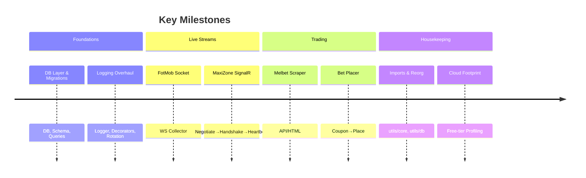
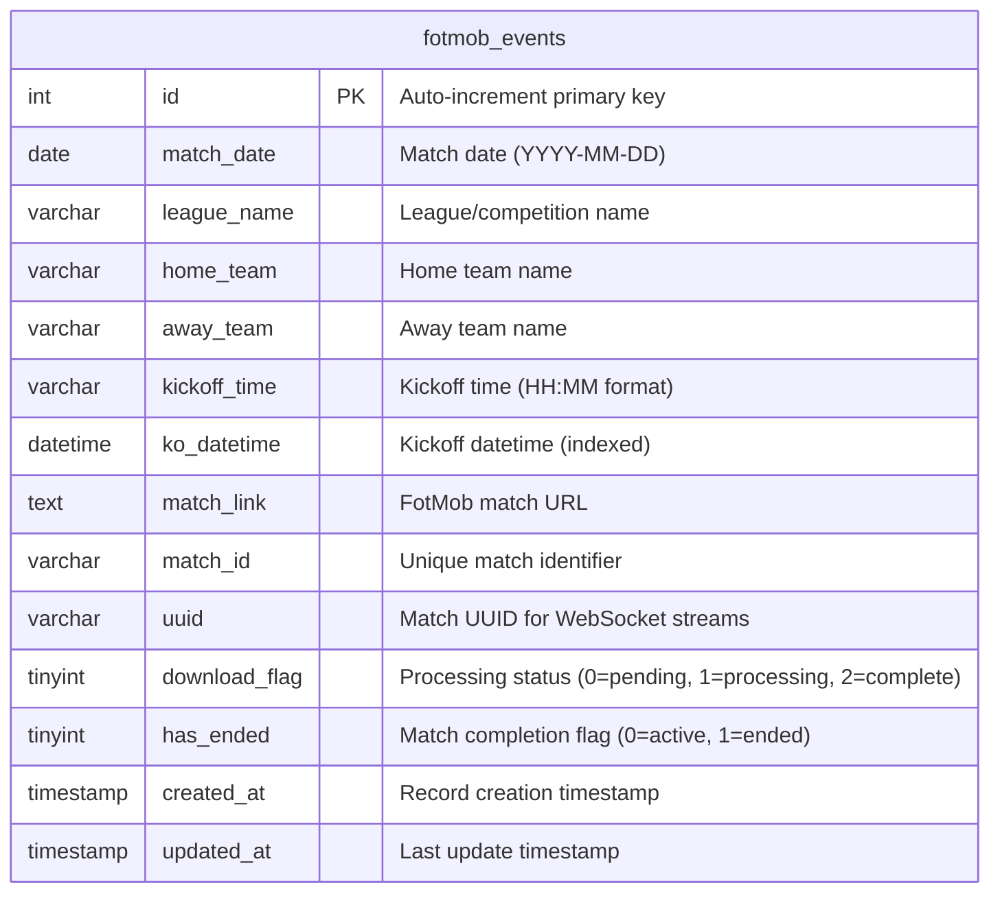
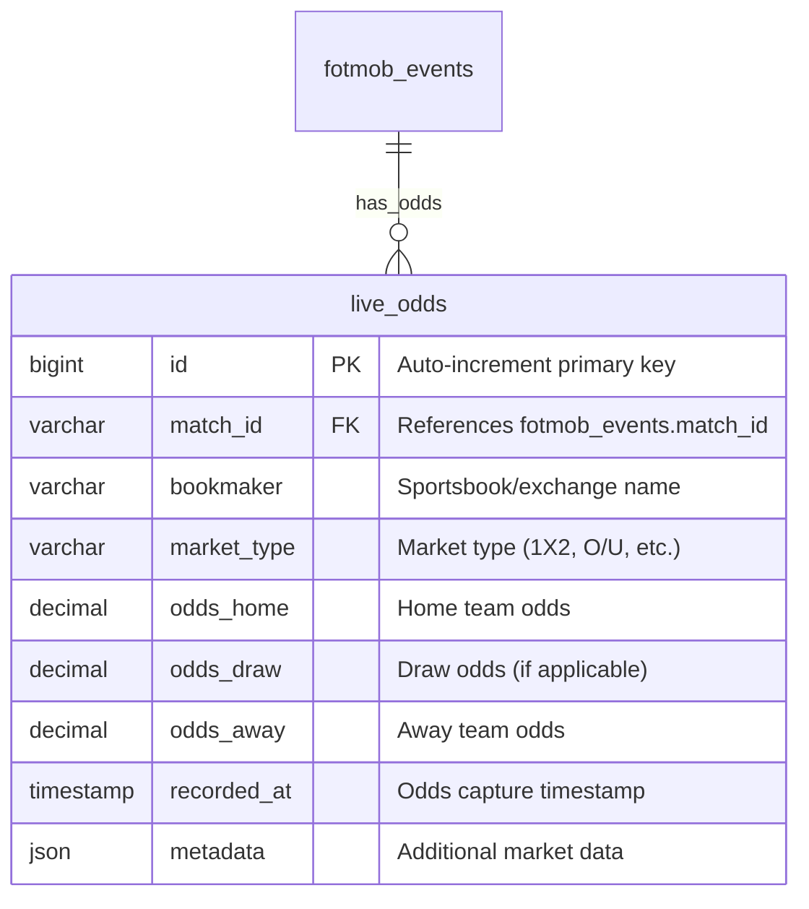

# Probo Trading & Live Sports Intelligence


> Real‑time collection of live odds and spatiotemporal match events to discover pre‑move betting opportunities.


---

## 🧭 About

This project is a toolkit and pipeline for real‑time sports intelligence and trading on betting exchanges. It focuses on collecting, structuring, and analyzing two rare, high‑value data streams:

- **Recording live game odds that aren’t publicly archived**
  - Continuous ingestion of exchange and sportsbook prices to build a private historical odds dataset.
  - Useful for post‑match analysis, model training, and market microstructure research.

- **Gathering and storing spatiotemporal event data (FotMob, MaxiZone)**
  - Structured, timestamped events and positional data for granular match understanding.
  - Enables mapping between event timelines and market reactions.

- **Finding opportunities to place bets before the market moves**
  - Stream fusion (events + odds) to detect informational edges.
  - Execution hooks available (e.g., Melbet bet placement flow) for rapid action.

Additional objectives and highlights:

- **Robust, production‑style logging** with function entry/exit tracing for reproducibility and debugging.
- **Centralized database layer** replacing flat files; schema adapted for time‑series and event search.
- **Multiple live connectors** (WebSockets, REST, Selenium) designed to run concurrently with minimal resources.
- **Cloud‑friendly footprint** so the full pipeline can run on free‑tier instances (~1 GB RAM, <1 vCPU).


### 📦 Key Components (selected)

- `fotmob_socket.py` — Live FotMob data stream collector.
- `maxizone_final.py` — Full SignalR WebSocket client for MaxiZone positional/events feed.
- `melbet.py` — Sportsbook data scraper (API/HTML as needed).
- `melbet_bet_placer.py` — Programmatic bet placement (coupon update + place bet).
- `utils/db/fotmob_db_manager.py` — Central DB access layer (MySQL), with time‑window queries.
- `utils/core/runner_logger.py` — Project‑wide logger with rotating, datetime‑named files.
- `utils/core/process_match_db.py` — Match processing utilities hooked to DB.


### 🗺️ High‑Level Architecture

```mermaid
flowchart LR
  A[Live Data Sources]:::src -->|WS / REST / Selenium| B((Ingestion))
  subgraph Sources
    A1[FotMob WS]:::ws
    A2[MaxiZone SignalR]:::ws
    A3[Sportsbook APIs]:::api
    A4[Selenium Browser]:::sel
  end
  A1 --> B
  A2 --> B
  A3 --> B
  A4 --> B
  B --> C[Structured Storage (MySQL)]:::db
  C --> D[Odds + Events Fusion]:::proc
  D --> E[Signal Detection / Pre‑move Alerts]:::alert
  E --> F[Execution Hooks (Bet Placer)]:::exec
  C --> G[Analytics / Modeling]:::ana

  classDef src fill:#F0F4F8,stroke:#94A3B8,color:#111827
  classDef ws fill:#E0F2FE,stroke:#38BDF8,color:#0C4A6E
  classDef api fill:#FEE2E2,stroke:#EF4444,color:#7F1D1D
  classDef sel fill:#DCFCE7,stroke:#22C55E,color:#064E3B
  classDef db fill:#FEF3C7,stroke:#F59E0B,color:#7C2D12
  classDef proc fill:#EDE9FE,stroke:#8B5CF6,color:#2E1065
  classDef alert fill:#FFE4E6,stroke:#FB7185,color:#881337
  classDef exec fill:#D1FAE5,stroke:#10B981,color:#064E3B
  classDef ana fill:#E5E7EB,stroke:#6B7280,color:#111827
```


---

## 🚀 Development Journey

A condensed narrative of how the project evolved (inspired by the commit history and milestone work):

- **Centralized Database Integration**
  - Migrated from PSV/flat files to a dedicated MySQL layer: `utils/db/fotmob_db_manager.py`.
  - Implemented time‑window queries (e.g., `get_matches_in_time_window`, `get_upcoming_matches`).
  - Result: faster queries, cleaner interfaces, and consistent data access across modules.

- **Datetime Indexing for Matches**
  - Added `ko_datetime` (kickoff datetime) to `fotmob_events` with an index.
  - Rewrote filtering logic in `fotmob_runner.py` to remove brittle parsing.
  - Result: simplified code, fewer edge cases, and better performance.

- **Professional Logging System**
  - Introduced `utils/core/runner_logger.py` with per‑run log files and console/file handlers.
  - Decorators for function entry/exit; timestamps + line numbers in a consistent format.
  - Result: traceable execution and faster debugging.

- **MaxiZone SignalR Client (Production‑ready)**
  - Implemented full negotiate/handshake/heartbeat and `ConnectClient` flow.
  - Receives live positional and event frames tagged per game.
  - Result: reliable spatiotemporal stream for event→market mapping.

- **Execution Path to Market (Melbet)**
  - Built `melbet_bet_placer.py` with the secure coupon update → place bet sequence.
  - Verified with real bet placement; robust error handling and logging.
  - Result: completes the feedback loop from detection → execution.

- **Project Structure Reorganization**
  - Consolidated utilities into `utils/core/` and `utils/db/`; archived legacy scripts.
  - Updated imports project‑wide to new module paths.
  - Result: improved maintainability and readability.

- **Operational Footprint Optimization**
  - Targeted free‑tier cloud profiles: ~0.9 vCPU, ~1 GB RAM for all services.
  - Split duties by process to enable concurrent data collection with minimal resources.




---

## 🔭 Upcoming

What’s planned next to increase data value, shareability, and edge discovery:

- **Transform raw odds into sharable, storage‑friendly formats**
  - Standardize to columnar/time‑series formats (e.g., Parquet + partitioned by date/market).
  - Schema versioning and metadata for provenance.

- **Map TID events to real‑world FotMob events (spatiotemporal alignment)**
  - Robust matching between TID timelines and event logs with tolerances and backfills.
  - Confidence scoring + conflict resolution for ambiguous mappings.

- **Public/Partner Data Interfaces**
  - Read‑only endpoints for research partners (REST + pre‑signed bundles).
  - Optional aggregation layers: per‑minute OHLC odds, event windows, and derived stats.

- **Analytics & Dashboards**
  - Lightweight dashboards for live monitoring and post‑match analysis.
  - Event→price reaction studies and latency diagnostics.

- **Reliability & Ops**
  - Graceful recovery, idempotent writes, and resumable ingestion.
  - Health checks, alerting, and per‑feed SLOs.

- **Packaging & Deployment**
  - Containerization with minimal images.
  - One‑click deploy to free‑tier providers; process supervisors.

- **Testing & QA**
  - Fixtures for replaying live streams.
  - Integration tests covering WS → DB → analytics path.


---

## 📊 Database Schema

### FotMob Events Table (`fotmob_events`)



### Odds Tables (Future Implementation)



## 🗂️ Project Structure

### Utils Components

| **Module** | **Location** | **Purpose** |
|------------|--------------|-------------|
| **Core Utilities** | `utils/core/` | |
| `runner_logger.py` | `utils/core/` | Professional logging with datetime-based files, function decorators |
| `config.py` | `utils/core/` | Configuration management and environment variables |
| `process_match_db.py` | `utils/core/` | Match processing utilities with database integration |
| `process_utils.py` | `utils/core/` | General processing utilities and helpers |
| `fotmob_uuid_extractor.py` | `utils/core/` | UUID extraction from FotMob match links |
| `log_utils.py` | `utils/core/` | Legacy logging utilities |
| **Database Layer** | `utils/db/` | |
| `fotmob_db_manager.py` | `utils/db/` | Central database operations manager with time-window queries |
| `config_loader.py` | `utils/db/` | Database connection configuration loader |
| `sync_psv_to_db.py` | `utils/db/` | PSV file to database synchronization utility |

### Data Collection Programs

| **Program** | **Resource Usage** | **Purpose** |
|-------------|-------------------|-------------|
| `fotmob_socket.py` | 0.1 vCPU, 128MB RAM | Live FotMob WebSocket data collector |
| `maxizone_final.py` | 0.1 vCPU, 128MB RAM | MaxiZone SignalR spatiotemporal events |
| `melbet.py` | 0.2 vCPU, 256MB RAM | Melbet sportsbook data scraper |
| `read_ws_fresh.py` | 0.5 vCPU, 512MB RAM | Selenium-based web scraping (Chrome/Brave) |
| `melbet_bet_placer.py` | 0.1 vCPU, 128MB RAM | Programmatic bet placement on Melbet |

## 📁 Sample Data

The `sample data/` directory contains real-world examples of collected data:

### Spatiotemporal Events (`sample data/spatiotemporal_events_2025-08-23/`)
- **8 match files** with live positional and event data from FotMob WebSocket streams
- **File format**: `{match_uuid}.log` (e.g., `14qo3uypv7lmce0ewcvxe89w4.log`)
- **Content**: JSON-formatted POEM events with:
  - Player positions (`X`, `Y` coordinates)
  - Event types (`TID` - event type IDs)
  - Timestamps (`TS` - ISO format)
  - Player details (`PLID`, `PN` - player ID and name)
  - Team information (`TEAMID`, `TUUID`)
  - Match statistics and qualifiers

### Betting Odds (`sample data/betodds_2025-08-23/`)
- **Directory structure** prepared for live odds data
- **Future content**: Time-series odds data from multiple sportsbooks

### Sample Event Structure
```json
{
  "data": {
    "OID": 2561906,
    "UUID": "14qo3uypv7lmce0ewcvxe89w4",
    "POEM": {
      "EVID": 32,
      "TS": "2025-08-23T17:33:49.946",
      "TID": 1,
      "PID": 1,
      "M": 3,
      "S": 25,
      "PLID": 214225,
      "PN": "J. Rodon",
      "TEAMID": 2,
      "X": 27.8,
      "Y": 57.9,
      "STAT": {"CPID": 1, "SC": "0:0"}
    }
  }
}
```

## 🛠️ Getting Started (quick sketch)

- Python 3.9+ and MySQL 8+
- Create a `.env` (or config) for DB creds and API tokens.
- Run individual collectors, e.g.:

```bash
python fotmob_socket.py
python maxizone_final.py
python melbet.py
```

- Logs will appear under `logs/` with per‑run files created by `utils/core/runner_logger.py`.
- Sample data available in `sample data/` for testing and analysis.


## 🤝 Contributing

Issues and PRs are welcome. Please include clear reproduction steps, logs (with sensitive data redacted), and proposed fixes.


## 📜 License

Proprietary – not for redistribution without permission.
